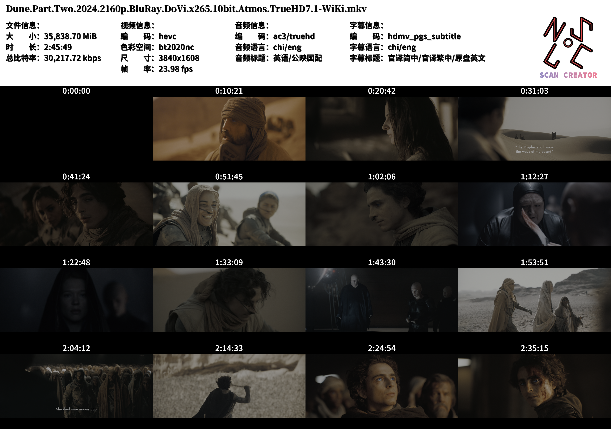

# Scan Creator

This project is a **video snapshot and metadata scanner** that captures snapshots at specified intervals from a video, formats them into a grid, and overlays essential metadata such as codec, resolution, bitrate, and language information. Additionally, it includes custom fonts and logo integration. **Please note: This project is in its early stages and may experience critical bugs.**

## Features

- **Snapshot Extraction**: Captures and resizes snapshots at set intervals across the video.
- **Metadata Display**: Displays video, audio, and subtitle details within the final scan image.
- **Customizable Layout**: Configurable grid layout for arranging snapshots.
- **Image Resizing & Logo Overlay**: Optional resizing for the final image and support for logo integration.

## Requirements

- **Python 3.12+**

> The project has been fully developed and tested under Python 3.12. Lower versions are not guaranteed to work.  
> You may attempt to run it under Python 3.8 by manually removing incompatible type annotations, but this is **not officially supported**.

- **FFmpeg** (for extracting frames from the video, type 'ffmpeg -version` in terminal to check)
- **Pillow** (PIL library for image manipulation)
- **Pydantic v2** (Used for configuration validation)

## Setup

0. **Download Repo**:

   ```bash
   git clone https://github.com/KJH-x/scans_creator.git
   ```

1. **Install dependencies**:

   ```bash
   pip install pillow
   pip install 'pydantic ~=2.0'
   ```

2. **Download FFmpeg**:
   Ensure FFmpeg is installed and accessible from the command line. You can download FFmpeg [here](https://ffmpeg.org/download.html).

3. **Fonts and Logo**:
   Place your chosen fonts in the `fonts/` directories.

当然，这里是生成好的 Markdown 代码版本，可直接放入 README：

## Usage

You can run the script either interactively or by providing CLI arguments.

```bash
python main.py --file "/path/to/video.mp4" --layout en.json --stream 0
```

- `--file` (optional): Path to the video file. If omitted, the script will ask interactively.
- `--layout` (optional): Layout preset to use (`zh-CN` by default). Determines font selection, grid size, and text arrangement.
- `--stream` (optional): Index of the video stream to use if multiple streams exist. If omitted and multiple streams exist, user will be prompted.

### What the script does

1. Verifies required files (video, fonts, and logo) based on the configuration.
2. Extracts video information (duration, resolution, file size, bitrate).
3. Calculates snapshot times based on grid size and optional leading/ending avoidance.
4. Captures snapshots at the calculated times.
5. Generates a composite scan image containing snapshots and metadata.
6. Optionally rescales the final image according to the configuration.
7. Saves the scan image as PNG in the `scans/` directory.

### Output format

```bash
scans/<timestamp>.scan.<video_filename>.png
```

- Contains a grid of snapshots with overlaid metadata according to the selected layout.

## Example Output

The output will be a composite image arranged in a grid layout, displaying snapshots and video metadata with a custom logo.



## Configuration Files

### Default Configuration

Backups of the default configuration files are saved at `schemas/defaults.json.bak`(Preview [here](https://github.com/KJH-x/scans_creator/blob/main/schemas/defaults.json.bak)). The SHA256 checksum of the file is hard-coded in the code to ensure the correctness of the file, and the program cannot run if the checksum does not match.

### `global.json`

This file contains the following configuration items:

- `logo_file`: Path to the logo image file to overlay on the scan.
- `fonts`: The path to several font files, you can specify the sequence number in the `font_list`.
- `resize_scale`: Scaling factor for resizing the final scan image (e.g., `2` means resize to half size).
- `avoid_leading`: If `true`, avoids taking snapshots from the very beginning of the video.
- `avoid_ending`: If `true`, avoids taking snapshots from the very end of the video.

### `layout/*.json`

This file is responsible for setting the layout style of the metadata (including font, font size, font color, layout, shadows, and information to be displayed).

- `font_list`: The font used for each paragraph of text.

- `time_font`: The font used to time the snapshot.

- Some spacing and margin parameters ([more details](https://github.com/KJH-x/scans_creator/wiki/TextDrawer)).

- `shade_offset`: The amount of shadow offset for the text.

- `text_color`: The color of the text.

- `shade_color`: The color of the shade.

- `text_list`:  The metadata to be displayed. (TODO: Details).

- `grid_size`: A tuple defining the grid size for snapshot arrangement (e.g., `[4, 4]` for a 4x4 grid).

You can update these values to suit your project needs. For example, if you'd prefer a smaller grid (or  bigger snapshots), change `"grid_size": [4, 4]` to `"grid_size": [3, 3]` for a 3x3 grid (9 snapshots).

## Limitations & Known Issues

- **Early Development**: This is an early-stage project, and bugs may result in crashes or incomplete image generation.
- **Error Handling**: Error handling is limited, especially for issues related to FFmpeg processing or missing metadata fields.

## License

MIT License

---

For any issues, please open an issue on the repository or contribute with a pull request.
