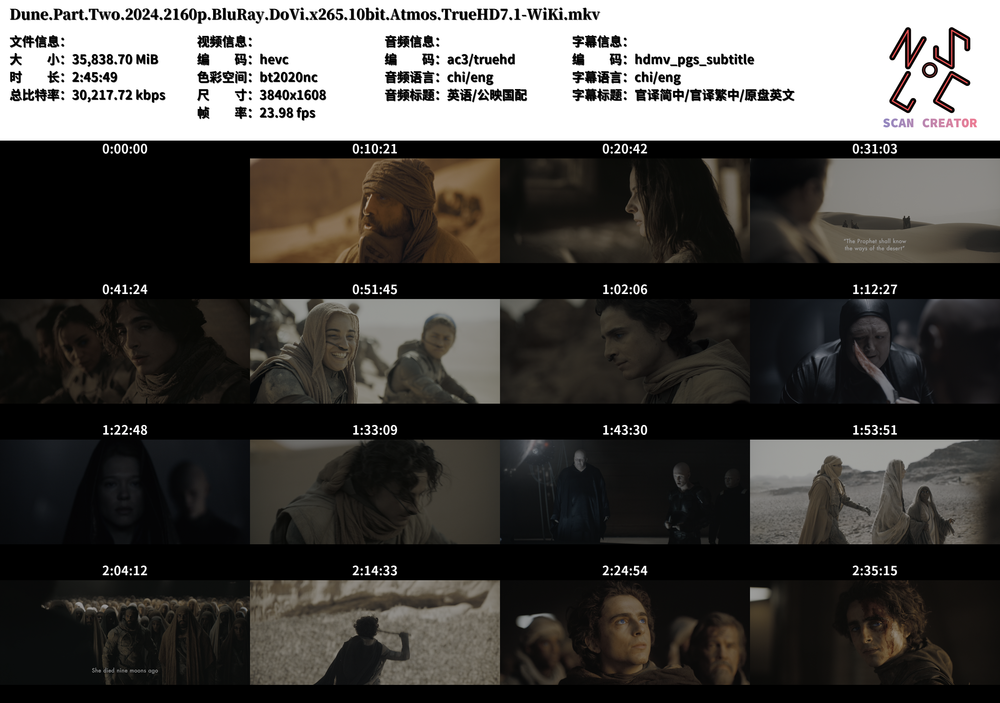

# Scan Creator

This project is a **video snapshot and metadata scanner** that captures snapshots at specified intervals from a video, formats them into a grid, and overlays essential metadata such as codec, resolution, bitrate, and language information. Additionally, it includes custom fonts and logo integration. **Please note: This project is in its early stages and may experience critical bugs.**

## Features

- **Snapshot Extraction**: Captures and resizes snapshots at set intervals across the video.
- **Metadata Display**: Displays video, audio, and subtitle details within the final scan image.
- **Customizable Layout**: Configurable grid layout for arranging snapshots.
- **Image Resizing & Logo Overlay**: Optional resizing for the final image and support for logo integration.

## Requirements

- **Python 3.10+**

> No python 3.8 supports. You can manully remove incompatible codes (type annotations) to run in python 3.8 (tested), but this repo will not offer directly.

- **FFmpeg** (for extracting frames from the video, type 'ffmpeg -version` in terminal to check)
- **Pillow** (PIL library for image manipulation)

## Setup

0. **Download Repo**:

   ```bash
   git clone https://github.com/KJH-x/scans_creator.git
   ```

1. **Install dependencies**:

   ```bash
   pip install pillow
   ```

2. **Download FFmpeg**:
   Ensure FFmpeg is installed and accessible from the command line. You can download FFmpeg [here](https://ffmpeg.org/download.html).

3. **Fonts and Logo**:
   Place your chosen fonts in the `fonts/` directories.

## Usage

1. Run the script:

   ```bash
   python main.py
   ```

2. The script will automatically load configuration settings from the `config/` directory. If the file does not exist, it will be created with default values.

3. Enter the **file path** to the video when prompted.

4. The script will:
   - Verify necessary files (fonts and logo) based on the paths provided in the `config/` directory.
   - Extract video information, including file size, duration, and bitrate.
   - Capture snapshots at evenly spaced intervals based on the grid size defined in the configuration.
   - Generate a composite image of snapshots with metadata and save it to the `scans/` directory.

5. The final scan image is saved as a PNG file in the format:

   ```bash
   scans/<timestamp>.scan.<video_filename>.png
   ```

## Example Output

The output will be a composite image arranged in a grid layout, displaying snapshots and video metadata with a custom logo.



## Configuration Files

### Default Configuration 

Backups of the default configuration files are saved at `schemas/defaults.json.bak`(Preview [here](https://github.com/KJH-x/scans_creator/blob/main/schemas/defaults.json.bak)). The SHA256 checksum of the file is hard-coded in the code to ensure the correctness of the file, and the program cannot run if the checksum does not match.

### `basic.json`

This file contains the following configuration items:

- `logo_file`: Path to the logo image file to overlay on the scan.
- `resize_scale`: Scaling factor for resizing the final scan image (e.g., `2` means resize to half size).
- `avoid_leading`: If `true`, avoids taking snapshots from the very beginning of the video.
- `avoid_ending`: If `true`, avoids taking snapshots from the very end of the video.
- `grid_size`: A tuple defining the grid size for snapshot arrangement (e.g., `[4, 4]` for a 4x4 grid).

You can update these values to suit your project needs. For example, if you'd prefer a smaller grid (or  bigger snapshots), change `"grid_size": [4, 4]` to `"grid_size": [3, 3]` for a 3x3 grid (9 snapshots).

### `info_layout.json`

This file is responsible for setting the layout style of the metadata (including font, font size, font color, layout, shadows, and information to be displayed).

- `fonts`: The path to several font files, you can specify the sequence number in the `font_list`.

- `font_list`: The font used for each paragraph of text.

- `time_font`: The font used to time the snapshot.

- Some spacing and margin parameters ([more details](https://github.com/KJH-x/scans_creator/wiki/TextDrawer)).

- `shade_offset`: The amount of shadow offset for the text.

- `text_color`: The color of the text.

- `shade_color`: The color of the shade.

- `text_list`:  The metadata to be displayed. (TODO: Details).

- `pos_list`: The text position of the initial version.

  > Now this parameter is no longer used because of the lack of flexibility unless you turn off the `use_new_method` in [scan_creator.py](https://github.com/KJH-x/scans_creator/blob/94e4145b9387cc5a10f6e1edc09217787949e172/scan_creator.py#L519)

## Limitations & Known Issues

- **Early Development**: This is an early-stage project, and bugs may result in crashes or incomplete image generation.
- **Error Handling**: Error handling is limited, especially for issues related to FFmpeg processing or missing metadata fields.

## License

MIT License

---

For any issues, please open an issue on the repository or contribute with a pull request.
